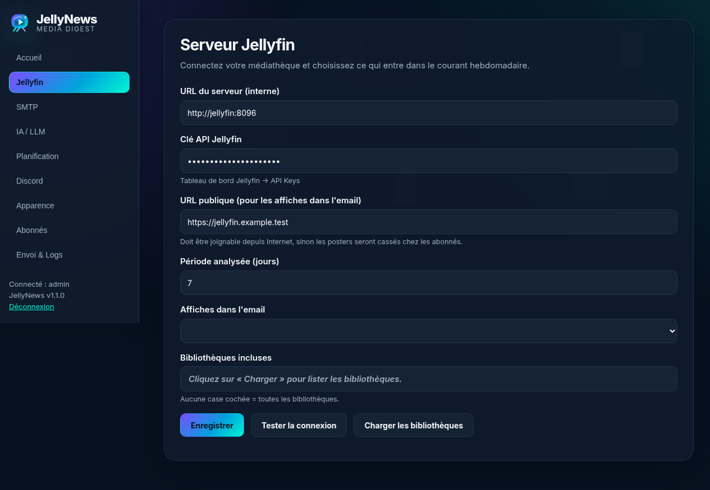
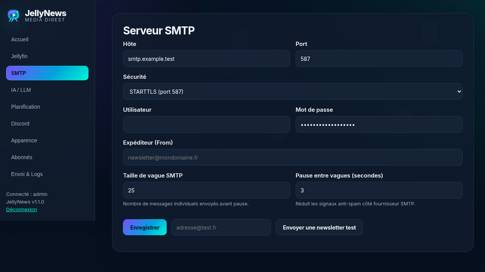
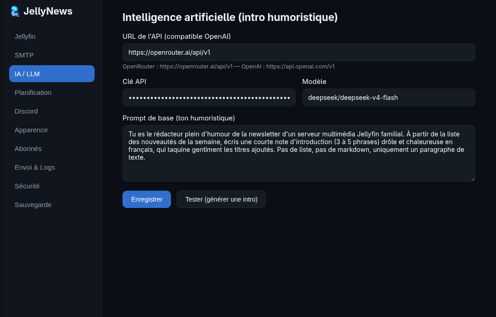
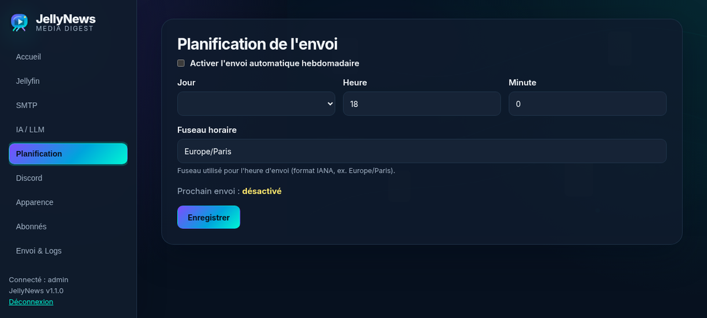
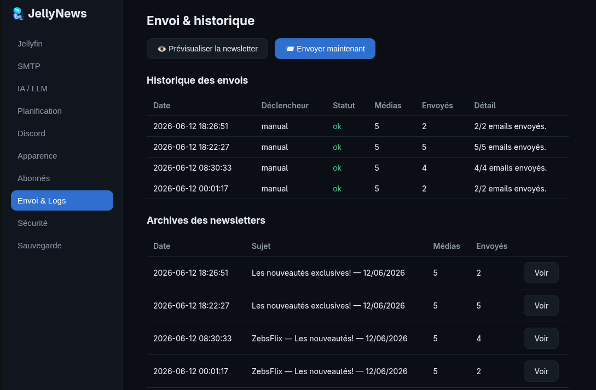

# 🪼 JellyNews

Gestionnaire de newsletter automatisé pour serveur **Jellyfin**, conteneurisé avec Docker.
Chaque semaine, l'application interroge l'API Jellyfin, récupère les nouveautés
(films, séries — avec regroupement des nouveaux épisodes par série — et musique),
génère une introduction humoristique via un LLM (OpenRouter/OpenAI), et envoie
une newsletter HTML sombre inspirée du thème **ElegantFin** à vos abonnés —
avec en option un résumé sur Discord.

## Aperçu

| Jellyfin | SMTP | IA / LLM |
|:---:|:---:|:---:|
|  |  |  |

| Planification | Envoi & Logs |
|:---:|:---:|
|  |  |

## Fonctionnalités

- **Affiches incorporées à l'email** (mode par défaut) : pas besoin d'exposer
  Jellyfin sur Internet ; ou mode « lien » pour des emails plus légers.
- **Désinscription en un clic** : lien signé par abonné + header
  `List-Unsubscribe` RFC 8058 (bouton natif Gmail/Outlook).
- **Filtrage par bibliothèque** : cochez les bibliothèques Jellyfin à inclure.
- **Titres et affiches cliquables** : deep links vers la fiche Jellyfin.
- **Archives** : chaque newsletter envoyée est consultable depuis l'admin.
- **Test LLM** dans l'interface (affiche l'erreur réelle de l'API).
- **Anti-brute-force** sur le login (5 essais / 15 min par IP).
- **Sauvegarde complète JSON** : configuration, abonnés, historique d'envoi et archives ; import fusionnel compatible avec les anciens exports de configuration v1.0.1.
- **Import/export abonnés CSV** : conservé pour les opérations rapides sur la liste d'abonnés.
- **Reverse-proxy** : configurable dans l'interface (IPs de confiance, cookie Secure).
- **Discord** : résumé optionnel par webhook.

## Sauvegarde et restauration

Depuis la version **v1.0.2**, le panneau d'administration expose une sauvegarde
JSON complète via `/api/settings/export`. Elle contient :

- la configuration applicative ;
- les abonnés ;
- les logs d'envoi ;
- les archives HTML des newsletters.

Le fichier est nommé `jellynews-backup-v1.0.2-secrets.json` car il contient les
secrets nécessaires au fonctionnement de JellyNews : clés Jellyfin, SMTP et LLM.
Stockez-le donc comme un secret, pas comme une simple pièce jointe de support.

L'import `/api/settings/import` restaure les données par fusion : il ajoute les
abonnés, logs et archives manquants, ignore les doublons détectés et met à jour
les paramètres connus. Les anciens exports v1.0.1 limités aux paramètres restent
compatibles ; dans ce cas, seuls les réglages reconnus sont restaurés.

Limites importantes : l'export n'inclut pas les comptes administrateurs,
`secret.key`, la base SQLite brute ni les fichiers uploadés comme le logo. Pour
un rollback complet, conservez toujours une copie du volume `data/` avant mise à
jour.

Voir aussi : [`docs/releases/v1.0.2.md`](docs/releases/v1.0.2.md).

## Démarrage

### Méthode 1 — Image pré-buildée (GHCR)

Créez un `docker-compose.yml` :

```yaml
services:
  jellynews:
    image: ghcr.io/zebs64/jellynews:latest
    container_name: jellynews
    restart: unless-stopped
    ports:
      - "8050:8000"
    environment:
      - TZ=Europe/Paris
      - DATA_DIR=/data
    volumes:
      - ./data:/data
```

```bash
docker compose pull
docker compose up -d
```

### Méthode 2 — Build depuis la source

```bash
git clone https://github.com/Zebs64/jellynews.git
cd jellynews
docker compose up -d --build
```

Puis ouvrez **http://localhost:8050** :

1. **First-time setup** : créez le compte administrateur (mot de passe haché en bcrypt).
2. **Jellyfin** : URL interne (ex. `http://jellyfin:8096`), clé API
   (Tableau de bord Jellyfin → Clés API). L'URL publique n'est nécessaire
   qu'en mode « lien » — le mode « incorporé » (par défaut) n'en a pas besoin.
3. **SMTP** : hôte, port, sécurité (STARTTLS/SSL), identifiants, expéditeur.
   Testez avec le bouton « Email de test ».
4. **IA / LLM** : clé API OpenRouter ou OpenAI + prompt humoristique.
   En cas d'échec du LLM, un texte de repli est utilisé (l'envoi n'est jamais bloqué).
5. **Planification** : jour + heure + fuseau horaire de l'envoi hebdomadaire.
6. **Discord** : URL de webhook (optionnel).
7. **Apparence** : titre + upload du logo (embarqué dans l'email en pièce jointe inline)
   + URL publique de JellyNews (nécessaire pour le lien de désinscription dans les emails).
8. **Abonnés** : ajoutez les adresses, puis « Prévisualiser » ou « Envoyer maintenant ».

## Arborescence

```
jellynews/
├── docker-compose.yml              # Build depuis la source
├── docker-compose-example.yml      # Pull image GHCR
├── Dockerfile
├── requirements.txt
├── README.md
├── screenshots/
├── data/                           # Volume persistant (créé au 1er lancement)
│   ├── jellynews.db                #   - configuration, abonnés, logs (SQLite)
│   ├── secret.key                  #   - clé de signature des sessions
│   └── uploads/logo.*              #   - logo personnalisé
└── app/
    ├── main.py                     # FastAPI : pages setup/login/dashboard
    ├── database.py                 # SQLite : settings, users, abonnés, logs
    ├── auth.py                     # bcrypt + cookies signés (itsdangerous)
    ├── scheduler.py                # APScheduler : cron hebdomadaire configurable
    ├── routers/api.py              # API d'administration (authentifiée)
    ├── services/
    │   ├── jellyfin.py             # Récupération des ajouts récents
    │   ├── llm.py                  # Intro humoristique (API compatible OpenAI)
    │   ├── mailer.py               # SMTP + logo inline (cid:)
    │   ├── discord.py              # Webhook Discord (embeds)
    │   └── newsletter.py           # Orchestration + rendu Jinja2
    ├── templates/
    │   ├── email/newsletter.html   # Template email (CSS 100 % inliné)
    │   └── web/                    # Interface d'administration
    └── static/                     # CSS + JS du portail
```

## Notes techniques

- **Sessions** : cookie HttpOnly + SameSite=Lax, signé avec une clé persistée
  dans le volume. Le flag Secure se configure dans l'onglet Sécurité de l'interface.
- **CORS** : aucun middleware CORS — le front et l'API partagent la même
  origine, c'est la configuration la plus sûre.
- **Secrets SMTP/LLM** : stockés dans SQLite (le serveur doit pouvoir les
  relire pour se connecter). Protégez le dossier `./data` en conséquence.
- **Template email** : tables HTML + CSS inliné uniquement (Gmail/Outlook ne
  supportent ni flexbox ni les feuilles de style externes). Logo en `cid:`
  et affiches en pièces jointes inline (Content-ID) — pas de dépendance à
  une URL publique, affichage garanti partout.
- **Personnalisation du template** : décommentez le montage du dossier
  `templates/email` dans `docker-compose.yml` pour l'éditer sans rebuild.
